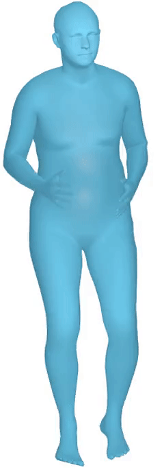
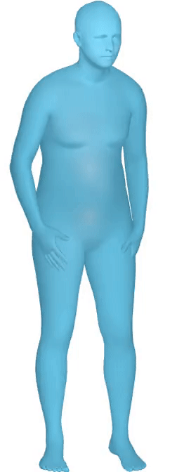
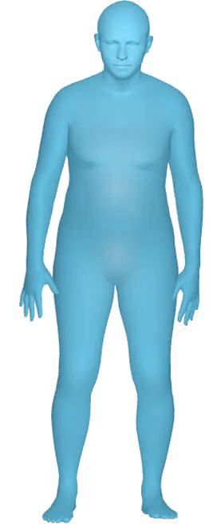
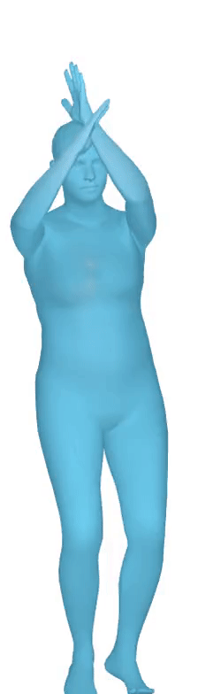
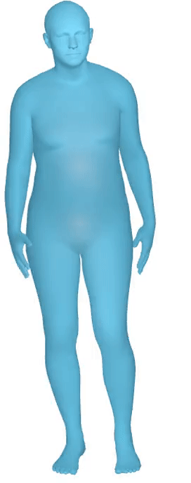
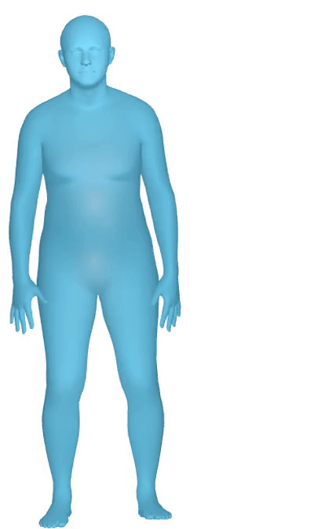

# CGMVAE-TU
Visualization of the paper "HUMAN MOTION GENERATION VIA CONDITIONED GMVAE WITH TUNET".

## Render motions
| Rush                                          | Sit                                          | Pick up                                          | Throw                                          | Walk                                          | Wave                                          |
|:--------------------------------------------------:|:--------------------------------------------------:|:--------------------------------------------------:|:--------------------------------------------------:|--------------------------------------------------|------------------------------------------|
|  | | ||||

